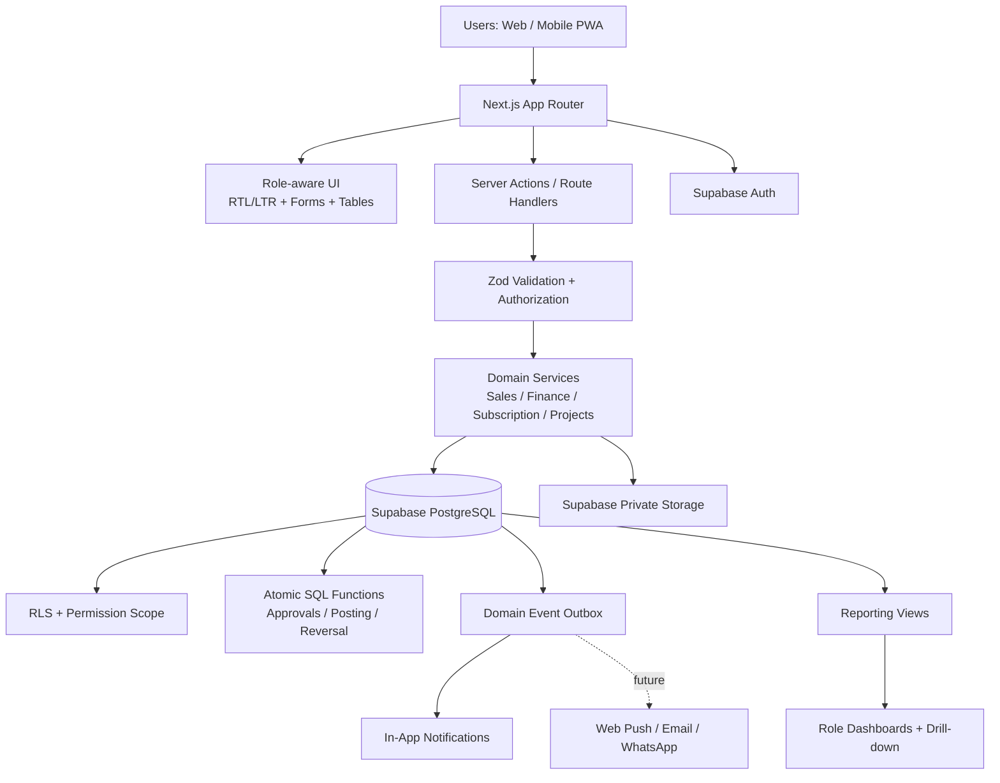
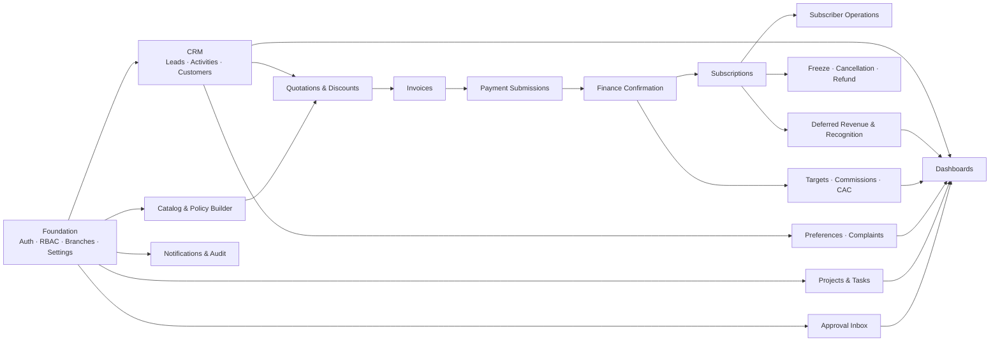
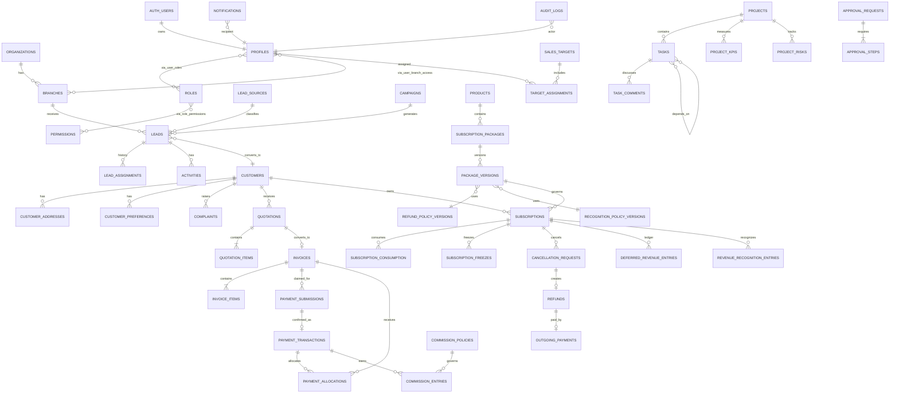

# مخطط تصميم Eco Healthy ERP — Master Blueprint

**حالة الوثيقة:** معتمدة للتنفيذ بعد إدخال التعديلات الإلزامية
**التاريخ:** 16 سبتمبر 2026
**المنطقة الزمنية التشغيلية:** `Africa/Cairo`
**العملة الأساسية:** `EGP` مع تصميم متعدد العملات

---

## 1. نتيجة فحص مساحة العمل

مساحة العمل الحالية فارغة من كود المشروع ولا تحتوي على مستودع Git أو تطبيق قائم؛ الموجود فقط مجلدا `outputs` و`work`. لذلك لا توجد قيود تقنية موروثة أو تغييرات سابقة يجب الحفاظ عليها. بعد اعتماد هذه الوثيقة ستكون البداية الصحيحة إنشاء هيكل مشروع GitHub-ready ثم migrations مرتبة، وليس تعديل مشروع موجود.

---

## 2. الفهم التنفيذي للنظام

Eco Healthy تحتاج ERP تشغيليًا وماليًا يبدأ من Lead، ويمر بالبيع والدفع والاشتراك والخدمة، وينتهي بتقارير يمكن تتبع كل رقم فيها إلى المعاملة الأصلية. النظام ليس CRM مؤقتًا ولا لوحة مؤشرات ببيانات تجريبية.

القواعد الحاكمة للتصميم:

1. **Payment Submission ليس Cash Collection.** هو مطالبة أرسلها Sales مع إثبات، ولا يؤثر في الأهداف أو العمولات أو الرصيد المدفوع.
2. **Cash Collection لا ينشأ إلا من Payment Transaction أكدها Finance.** المعاملة المؤكدة غير قابلة للتعديل؛ التصحيح يتم بـReversal/Adjustment مرتبط بالأصل.
3. **Cash Collection ليس Revenue.** التحصيل المخصص لاشتراك يكوّن التزام Deferred Revenue، ثم يُعترف بالإيراد بحسب الاستهلاك الفعلي وسياسة العقد.
4. **العقد يحتفظ بنسخة السياسات.** السعر، الخصم، قيمة الإلغاء اليومية، طريقة الاعتراف، التجميد، الاحتياطي والعمولة ترتبط بإصدارات سارية وقت البيع ولا تتغير رجعيًا.
5. **Maker–Checker إلزامي.** منشئ الطلب لا يعتمد طلبه في العمليات الحساسة، مع فصل إضافي عند تنفيذ/تأكيد المدفوعات الخارجة.
6. **المصدر الواحد للحقيقة.** مؤشرات اللوحات Views محسوبة من معاملات أصلية، لا أرقام يكتبها المستخدم يدويًا.
7. **العمليات اليومية سريعة.** Quick Entry وQuick Actions وحقول قليلة حسب الدور، بينما التفاصيل المحاسبية والـaudit تُنتج تلقائيًا.
8. **الأمن في قاعدة البيانات.** الواجهة لا تُعد طبقة حماية؛ RLS وصلاحيات الخادم تمنع الوصول والتعديل غير المصرح بهما.

### النموذج المالي المختصر

```text
Payment Submission (claimed, pending)
    └─ Finance approval
       └─ Payment Transaction (confirmed cash, immutable)
          └─ Payment Allocation (invoice/subscription)
             └─ Deferred Revenue Ledger (liability)
                ├─ Revenue Recognition Entries (service consumed)
                └─ Refund/Reversal Entries (approved and executed)
```

المعادلة الرقابية للفترة:

```text
Opening Deferred Revenue
+ Confirmed Collections Allocated to Subscriptions
- Revenue Recognized
- Refunds Applied Against Deferred Revenue
= Closing Deferred Revenue
```

```text
Fulfillment Reserve = Closing Deferred Revenue × applicable estimated remaining fulfillment cost %
Available Cash After Reserve = Eligible Confirmed Cash - Executed Outflows - Fulfillment Reserve
```

ولا يلزم تخصيص التحصيل المؤكد بالكامل فورًا:

```text
Confirmed Cash = Allocated Cash + Unallocated Cash
Unallocated Cash = Customer Credit + Advance Payment + Suspense Cash
Amount Available for Allocation = Confirmed Cash - Active Allocations - Reversed Amount
```

لا يدخل أي مبلغ في Deferred Revenue الخاص باشتراك إلا عند وجود تخصيص نافذ إلى عقد/اشتراك. إعادة التخصيص لا تعدل التخصيص القديم؛ تنشئ reversal للتخصيص ثم allocation جديدًا مع audit وapproval عند تجاوز السياسة.

> `Available Cash After Reserve` مؤشر إداري وليس رصيد بنك محاسبيًا نهائيًا حتى بناء/ربط دفتر الأستاذ العام والتسوية البنكية.

---

## 3. افتراضات التصميم القابلة للتعديل

| الافتراض المبدئي | القرار المقترح | أين يُضبط لاحقًا |
|---|---|---|
| طريقة الاعتراف الافتراضية | Per Delivered Day، مع دعم Daily وPer Meal وManual Adjustment | Package/System Builder → Policy Version |
| تاريخ التشغيل | تُحفظ كل التواريخ في UTC وتُعرض بتوقيت القاهرة | Organization Settings |
| العملة | EGP، وكل مبلغ يحمل `currency_code` | Finance Settings |
| قيمة الإلغاء اليومية | من Refund Policy Version؛ لا يوجد رقم ثابت | Package/System Builder |
| نسب العمولة والـbonus | من Commission Policy Version؛ لا تُثبت 3% أو 2% في الكود | Sales Settings |
| حدود الخصم | Rules متعددة الأبعاد وأولوية واضحة، بلا نسب ثابتة | Discount Authority Matrix |
| حدود موافقة CEO | حسب النوع والمبلغ والفرع والمخاطر | Approval Matrix |
| احتساب اليوم المستهلك | من سجل خدمة/استهلاك مؤكد، لا من مرور يوم تقويمي فقط | Recognition Policy |
| الضرائب | حقول وقواعد أساسية قابلة للتوسعة؛ لا تكامل ضريبي حكومي في Phase 1 | Finance/Tax Settings |
| المحاسبة | Subledger تشغيلي مضبوط؛ General Ledger كامل خارج Phase 1 | Integration Settings لاحقًا |
| الفروع | كل سجل تشغيلي يحمل `branch_id` عند الحاجة، مع صلاحيات فرع/عدة فروع/الكل | Access & Branch Settings |

أي تغيير في إعداد مالي مؤثر ينشئ نسخة جديدة بتاريخ سريان؛ لا يعدل النسخة المرتبطة بعقد قائم.

---

## 4. النطاق الوظيفي الكلي وتوزيعه المرحلي

### داخل النطاق الكلي

القائمة التالية تصف نطاق Eco Healthy ERP المستهدف، ولا تعني تنفيذ العناصر كلها في Phase 1. ترتيب التنفيذ الملزم هو Roadmap في القسم 13: Foundation فقط في Phase 1، ثم Tasks، CRM، Catalog، Finance، Doctors، Integrations وأخيرًا Subscriptions.

#### الأساس المؤسسي

- Supabase Auth، Profiles، الفروع، الأقسام، الفرق.
- RBAC granular مع نطاق ملكية/فريق/فرع/كل الشركة.
- RLS، Audit Trail، Attachments، Settings وإصدارات السياسات.
- Central Approval Inbox وIn-App Notification Center ومسار توسعة PWA/Web Push.
- Arabic RTL وEnglish LTR، responsive UI، global search الأساسي.

#### CRM والمبيعات

- Leads، التوزيع وإعادة التوزيع، الأنشطة والمتابعات، SLA والـaging.
- Customer Master ومنع التكرار والدمج المصرح به.
- Customer 360، العناوين، الملاحظات المقيدة، التفضيلات الغذائية والطبية وتاريخها.
- Products، Packages، Plans، Pricing/Refund/Freeze/Recognition policy versions.
- Quotations، الخصومات والموافقات، Invoices وPDF قابل للطباعة.

#### التحصيل والاشتراكات

- Payment Submission مع proof، مراجعة Finance، approve/reject/partial/duplicate.
- معاملات التحصيل المؤكدة مع Partial Allocation وUnallocated Cash وCustomer Credit وAdvance Payment وSuspense Collection؛ reversal/reallocation موثق فقط.
- Subscription contracts، activation، consumption، balances، renewal status.
- Deferred revenue، recognition، fulfillment reserve، reconciliation.
- Freeze، cancellation، churn reasons، retention attempt، refund lifecycle.
- Refund/outgoing payment execution مع إثبات وفصل approval عن payment confirmation.
- Subscriber Operations Center وDaily Service List المخططة والمنفذة والقابلة للتصدير.

#### نقل البيانات والـCutover

- Import batches مع preview وvalidation قبل الحفظ النهائي.
- قوالب customers، subscriptions، remaining days، customer balances، opening deferred، historical collections، representatives، packages/prices، targets، complaints، freezes وrefund requests.
- كل صف مستورد يحمل batch/source/importer/date/validation/opening-balance metadata.
- تقرير valid/invalid/duplicate/missing/reconciliation difference، مع قائمة مبالغ suspense غير المرتبطة.
- منع Production Go-Live حتى تطابق opening customer balances وopening subscription balances وتفاصيل opening deferred revenue.

#### الأداء والخدمة

- Targets، forecast، commissions والـclawbacks.
- Marketing spend الأساسي، CAC، ومقاييس LTV/retention مع confidence level.
- Complaints، SLA، root cause، service recovery والتصعيد.
- Sales/Finance/CEO dashboards مع filters وdrill-down إلى المصدر.

#### المشروعات

- Projects، KPIs، risks، members، tasks، dependencies، comments، evidence.
- List/Kanban/Calendar/My Tasks/Overdue/Approvals.
- اعتماد إنجاز المهمة عند الحاجة وتحديث تقدم المشروع.

### خارج النطاق الحالي أوالمؤجل لما بعد Roadmap المعتمد

- Website e-commerce وcheckout عام.
- Kitchen/production execution، الوصفات، تخطيط الإنتاج، الهدر.
- Inventory، purchasing، vendors، warehousing الكاملة.
- Delivery routing/dispatch وتتبع السائقين.
- Customer mobile app/portal.
- HR، attendance، payroll.
- General Ledger، chart of accounts، bank reconciliation والمحاسبة القانونية الكاملة.
- تكامل بوابات الدفع الفعلي، البنوك، هيئة الضرائب/e-invoicing.
- WhatsApp/SMS/Email automation الفعلي.
- Web Push الفعلي؛ تُبنى قابلية الربط ويظل In-App هو الأساس.
- Machine-learning churn/LTV؛ Phase 1 يستخدم قواعد وصيغ شفافة ودرجة ثقة.
- Excel export المتقدم؛ CSV والطباعة داخل Phase 1، وExcel لاحقًا.

---

## 5. معمارية النظام



### قرارات معمارية

- **Next.js TypeScript monolith modular:** أسرع في Phase 1، مع حدود domain واضحة تسمح بفصل خدمات مستقبلًا.
- **العمليات الحساسة Server-side فقط:** اعتماد دفع، reversal، posting، refund، period reopen، attribution change.
- **PostgreSQL transactions:** كل انتقال حساس ينفذ ذريًا: تغيير الحالة + ledger entry + audit + event.
- **RLS deny-by-default:** كل جدول حساس يفعّل RLS، ولا توجد policy عامة شاملة.
- **Private storage:** الإثباتات والمستندات عبر signed URLs قصيرة العمر، مع metadata وصلاحيات في DB.
- **Outbox pattern:** الحدث يُسجل داخل نفس transaction ثم يولد notification؛ يمنع فقد الإشعار بعد نجاح العملية.
- **Ledgers append-only:** لا تحديث ولا حذف للسجلات المالية المنشورة؛ reversing entry يحمل رابط الأصل والسبب.
- **Views قبل materialized views:** نبدأ باستعلامات مفهرسة؛ materialization فقط بعد قياس الأداء.
- **كل dashboard card له drill-down:** يحتفظ الفلتر نفسه ويعرض السجلات المصدرية المكوّنة للرقم.

### معايير البيانات

- PKs من نوع UUID، وbusiness identifiers منفصلة مثل `CUS-...` و`INV-...`.
- `numeric(18,2)` للأموال و`char(3)` للعملة؛ ممنوع float.
- `timestamptz` للتوقيت و`date` للفترات التجارية.
- `created_at/updated_at/created_by/updated_by` حيث يلزم.
- `branch_id` و`organization_id` من البداية لتجنب إعادة البناء.
- optimistic concurrency عبر `version` في السجلات المعرضة لتعديل متزامن.
- status transitions عبر service/functions، لا تحديث status عشوائيًا.
- PII الحساسة مثل National ID وmedical warnings بصلاحيات مستقلة، مع تقليل الظهور في القوائم.

---

## 6. خريطة الـModules



وحدات مستقبلية تتصل بعقود ثابتة: Website، Kitchen، Inventory، Delivery، Customer App، HR، General Ledger. الربط سيكون عبر IDs وأحداث domain، وليس بالوصول المباشر إلى واجهات Phase 1.

---

## 7. End-to-End Subscription Sales Flow

### المسار الطبيعي

1. **إنشاء Lead:** Sales Manager يستورد/ينشئ، أو Rep ينشئ self-generated lead. النظام يفحص الهاتف والبريد ويعرض duplicate warning.
2. **التوزيع:** المدير يعيّن Rep وفرعًا، ويسجل assignment history وسبب أي reassignment.
3. **المتابعة:** Rep يسجل الاتصال سريعًا مع outcome وnext action/date؛ يحسب النظام response time وaging وSLA.
4. **التأهيل:** لا يتحول Lead إلى Lost بلا سبب منظم. عند Qualified يبدأ عرض package مناسب.
5. **Customer:** إنشاء/ربط customer موحد بعد duplicate check. الدمج بصلاحية خاصة ويحافظ على كل العلاقات.
6. **اختيار Package Version:** يثبت النظام السعر والسياسات السارية: refund/freeze/recognition/cost/commission eligibility.
7. **Quotation:** يحسب standard price والخصم والضريبة/net. الخصم خارج سلطة المستخدم ينشئ approval ويمنع التحويل النهائي.
8. **Invoice:** بعد الموافقات تُصدر الفاتورة. إصدارها لا يعني الدفع، ولا يغير target أو commission.
9. **Payment Submission:** Sales يكتب claimed amount والطريقة والتاريخ/reference ويرفع proof. الحالة Submitted/Under Review فقط.
10. **Finance Review:** Finance يرى المطالبة والإثبات والبنك/الخزنة، ويفحص duplicate/reference/amount/fees/attribution.
11. **قرار Finance:**
    - Reject/Duplicate: لا cash ولا target ولا commission؛ سبب وإشعار ومسار resubmission.
    - Partially Approved: transaction بالمبلغ المؤكد فقط والباقي يظل outstanding.
    - Approved: إنشاء immutable payment transaction بالمبلغ المؤكد وتاريخ التحصيل الفعلي.
12. **Allocation:** يمكن تخصيص confirmed amount كليًا أو جزئيًا إلى invoice/subscription. الباقي يظل Customer Credit/Advance أو Suspense إذا لم تُعرف هويته، ولا يدخل Deferred Revenue قبل التخصيص.
13. **الآثار الذرية:** تحديث invoice paid/outstanding، target actual، estimated commission، customer paid balance، notification وaudit.
14. **Subscription:** يصبح العقد eligible for activation وفق سياسة الدفع؛ يرتبط package version وinvoice وallocations.
15. **Activation:** مستخدم مخول يحدد actual start؛ يظهر المشترك في Operations Center وdaily service list.
16. **Deferred Revenue:** الجزء المحصل والمخصص لخدمات مستقبلية يسجل في deferred ledger، لا revenue.
17. **Service Planning:** Operations تنشئ أو تستورد Planned Service List ثم تحول السجلات إلى Scheduled. وجود السجل أو مرور التاريخ لا يثبت التنفيذ.
18. **Delivery Confirmation:** مستخدم Operations مخول يؤكد فرديًا أو Batch أن الخدمة أصبحت Confirmed Delivered. Frozen/Cancelled/Not Delivered/Exception لا تعترف بإيراد.
19. **Recognition:** job يومي idempotent ينشئ recognition entries من Confirmed Delivered فقط، ويحدث recognized/deferred/reserve views.
20. **Correction:** تأكيد خاطئ لا يُحذف؛ ينشأ Delivery Confirmation Reversal يحتاج سببًا واعتماد Operations Manager، وFinance أيضًا إذا كانت الفترة مقفلة أو recognition تم ترحيله، ثم ينشأ revenue reversing entry.
21. **Renewal/Complaint/Freeze/Cancellation:** تظهر في Customer 360 والـtimeline وتنتج approvals/notifications حسب الحدث.
22. **Cancellation/Refund:** النظام يلتقط policy snapshot، يحسب consumed value والحد الأقصى للاسترداد، ثم review → approval → payment → independent confirmation حسب القواعد.
23. **Reconciliation:** تقارن Finance opening + allocated collections - recognized - refunds بالclosing، وأي فرق يظهر exception قابلًا للتتبع.

### ضوابط مالية أساسية

- لا يستطيع Sales إنشاء `payment_transactions` أو تعديل confirmed amount أو confirmation date.
- لا يحتسب target/commission من `payment_submissions` إطلاقًا.
- reference uniqueness يكون داخل method/account/provider context، مع proof fingerprint للتنبيه عن التكرار.
- confirmed transaction لا تُعدّل؛ reversal مساوٍ/جزئي بإشارة عكسية مع `reverses_transaction_id`.
- reversal لا يمحو الأثر القديم، ويعيد حساب target/commission/deferred عبر entries مقابلة.
- تغيير attributed representative بعد التأكيد لا يغير الأصل مباشرة؛ ينشئ attribution change approval وسجل أثر.
- الفترة المقفلة ترفض posting؛ reopen يحتاج صلاحية وموافقة وسببًا.
- refund ≤ confirmed cash not previously reversed/refunded و≤ remaining eligible balance.
- manual recognition/financial adjustment يحتاج permission منفصلًا وapproval reference.
- unallocated cash يدخل confirmed cash العام لكنه لا يدخل subscription deferred أو subscription revenue.
- reallocation بعد التأكيد يحتفظ بكل allocation/reversal history، ويحتاج approval عند تغيير العميل أو العقد أو الفترة أو attribution المالي.

### دورة الخدمة اليومية والاعتراف بالإيراد

```text
Planned → Scheduled → Confirmed Delivered
                  ├→ Cancelled
                  ├→ Frozen
                  ├→ Not Delivered / Failed
                  └→ Exception

Confirmed Delivered → Reversal Requested → Reversed Confirmation
```

- صلاحية `service.confirm_delivery` تمنح Operations users المحددين؛ Customer Service وSales لا يؤكدان التسليم.
- Batch confirmation متاح فقط لسجلات الفرع/التاريخ الظاهرة للمستخدم، مع preview وعدد السجلات والاستثناءات وidempotency key.
- كل سجل يحمل `service_date`, `planned_at`, `confirmed_by`, `confirmed_at`, `confirmation_batch_id` وحالة الفترة المالية وقت الإجراء.
- reversal يحتاج `service.reverse_confirmation` وسببًا، واعتماد Operations Manager؛ إذا كانت الفترة مغلقة يلزم Finance period exception/reopening وفق السياسة.
- لا حذف لأي confirmation أو recognition؛ التصحيح entries مقابلة مرتبطة بالأصل.

### الإلغاء والاسترداد

```text
Consumed Value
= eligible consumed units × cancellation unit value from contract policy version

Proposed Refund
= confirmed allocated cash
- consumed value
- approved non-refundable charges
- previous completed refunds
- policy-authorized adjustments
```

ثم يطبق النظام الحد الأدنى بين الناتج و`remaining eligible balance`، ولا يسمح بنتيجة سالبة أو أكبر من التحصيل المؤكد.

---

## 8. آلات الحالات Status Machines

كل انتقال يسجل actor/time/from/to/comment/request-id، وقد يتطلب permission وapproval.

| الكيان | المسار الرئيسي | استثناءات مضبوطة |
|---|---|---|
| Lead | New → Assigned → Contacted → Qualified → Offer Sent → Negotiation → Awaiting Payment → Won | Lost يحتاج reason؛ Duplicate يحتاج canonical lead؛ Deferred يحتاج next date |
| Quotation | Draft → Pending Approval → Approved → Sent → Accepted → Converted | Rejected يعود للتصحيح كنسخة جديدة؛ Expired/Cancelled نهائيان |
| Invoice | Draft → Pending Approval → Issued → Payment Under Review → Partially Paid/Paid | Cancelled قبل posting وفق policy؛ Partially/Refunded عبر transactions فقط |
| Payment Submission | Draft → Submitted → Under Finance Review → Approved/Partially Approved | Rejected/Duplicate؛ Approved لا يعود للخلف؛ correction ينشئ resubmission |
| Payment Transaction | Posted | Posted → Partially Reversed/Reversed بإدخال مقابل، لا تعديل |
| Payment Allocation | Active | Active → Reversed ثم New Allocation؛ لا تعديل target بعد posting دون policy |
| Daily Service | Planned → Scheduled → Confirmed Delivered | Scheduled → Cancelled/Frozen/Not Delivered/Exception؛ Confirmed → Reversed Confirmation |
| Subscription | Draft → Awaiting Payment → Paid Pending Activation → Scheduled → Active → Completed | Frozen ↔ Active؛ Cancelled/Refunded/Partially Refunded حسب workflow |
| Freeze | Requested → Under Review → Approved → Active → Completed | Rejected/Cancelled مع reason |
| Cancellation | Requested → Sales Review → Finance Review → Approved → Scheduled for Payment → Paid Pending Confirmation → Completed | Rejected/Cancelled؛ return for correction يحافظ على history |
| Refund/Outgoing Payment | Draft → Submitted → Finance Review → Awaiting Approval → Approved → Scheduled → Paid Pending Confirmation → Completed | Returned/Rejected/Cancelled؛ payment confirmation بفاصل أدوار عند اللزوم |
| Commission | Estimated → Pending Period Close → Finance Review → Approved → Paid | Adjusted/Reversed بentries مقابلة |
| Complaint | New → Acknowledged → Assigned → Under Investigation → Resolution Proposed → Resolved → Closed | Waiting states؛ Reopened؛ Critical escalation |
| Project | Idea → Planning → Pending Approval → Approved → Active → Completed | At Risk/On Hold؛ Cancelled مع reason |
| Task | Backlog → Ready → In Progress → In Review → Completed | Waiting/Blocked؛ approval-required لا تصبح Completed قبل reviewer approval |
| Approval | Pending → Approved/Rejected/Returned/Expired | لا يستطيع requester اعتماد طلبه؛ القرار نهائي ويولد طلبًا جديدًا عند إعادة التقديم |

---

## 9. Approval Matrix المقترحة

القواعد الفعلية تُخزن في `approval_policies` و`approval_policy_steps` حسب النوع، المبلغ، العملة، الفرع، القسم، نسبة الخصم، المخاطر والدور. الجدول التالي يحدد المسؤولية لا الحدود الرقمية.

| العملية | Maker | Reviewer/Checker | Approver | ضوابط وتصعيد |
|---|---|---|---|---|
| Lead reassignment | Sales Manager/Leader | — | حسب permission | السبب إلزامي؛ إشعار المالك القديم والجديد |
| Customer merge | Customer Service/Sales Manager | Data steward أو Manager آخر | مخول `customers.merge` | preview للعلاقات؛ لا حذف للتاريخ |
| Discount داخل السلطة | Sales user | Policy engine | Auto/authorized manager حسب السياسة | يسجل reason وstandard price؛ maker-checker عند الاستثناء |
| Discount فوق السلطة | Sales user | Sales Leader/Manager | المستوى المطابق أو CEO عند threshold | لا إصدار نهائي قبل الاعتماد |
| Invoice issue | Sales | policy/manager عند الحاجة | مخول `invoices.issue` | لا أثر نقدي بمجرد الإصدار |
| Incoming payment | Sales/collector | Finance Accountant | Finance checker/Manager وفق المخاطر | المنشئ لا يؤكد؛ CEO للاستثناءات فقط |
| Payment reversal | Finance authorized user | Finance Manager | مستوى إضافي عند مبلغ/فترة مقفلة | reason + original transaction + period controls |
| Payment reallocation | Finance authorized user | Finance Manager أو policy checker | مستوى أعلى عند تغيير customer/closed period | reverse old allocation + new allocation؛ لا overwrite |
| Service batch confirmation | Operations authorized user | validation preview | حسب policy auto أو Operations Manager | فقط scheduled rows؛ batch result محفوظ |
| Delivery confirmation reversal | Operations requester | Operations Manager | Finance عند recognition/closed period | revenue reversing entry ولا حذف |
| Subscription activation | Sales/Operations request | payment eligibility engine | Operations/authorized role | لا تفعيل بلا شروط الدفع، إلا exception approval |
| Freeze | Customer Service/Sales | Operations/Customer Service reviewer | policy-authorized manager | max days وعدد مرات التجميد من contract policy |
| Cancellation | Customer Service/Sales | Sales/CS ثم Finance | المخول حسب القيمة والمخاطر | أسباب منظمة + retention attempt + policy calculation |
| Refund amount | System/requester | Finance | authorized approver؛ CEO فوق threshold | requester ≠ approver؛ سقف eligible balance |
| Refund execution | Treasury/Finance | Finance checker | paid confirmation by separate user when configured | proof إلزامي؛ completed بعد التأكيد |
| Commission | System | Finance | Sales/Finance authority حسب policy | period close + quality gate + clawback |
| Marketing spend | Requesting department | Finance/budget owner | amount-based approver | supporting document وبند budget |
| Financial adjustment | Finance authorized | Finance Manager | CEO/second authority حسب threshold | لا تعديل أصل؛ adjustment entry فقط |
| Attribution change | Sales Manager | Finance | policy approver | تنبيه أثر target/commission قبل القرار |
| Period reopening | Finance Manager | — | CEO/Super Admin المصرح | reason، time-box، audit، ثم إعادة إغلاق |
| Project budget | Project Owner | Finance/Department Head | Sponsor/CEO حسب threshold | لا CEO لكل مشروع صغير |
| Task completion | Assignee | Reviewer | reviewer نفسه إن كان مخولًا | evidence إذا مطلوب؛ assignee لا يعتمد نفسه |

### ترتيب اختيار قاعدة الموافقة

تُختار القاعدة الأكثر تحديدًا: `user` ثم `role + package/campaign/branch` ثم `role` ثم default المؤسسة. عند تعارض قاعدتين بنفس التحديد تُطبق القاعدة الأكثر تحفظًا ويظهر Configuration Warning.

---

## 10. Roles and Permissions Matrix

**الرموز:** `O` بياناته فقط، `T` فريقه، `B` فروعه، `A` كل الشركة، `M` إدارة/اعتماد حسب policy، `R` قراءة فقط، `—` ممنوع. الصلاحية النهائية = permission + data scope + branch membership + maker-checker.

| الدور | Leads/Customers | Quotes/Invoices | Payment Submit | Payment Confirm | Subscriptions/Ops | Refunds | Targets/Commission | Complaints | Projects/Tasks | Dashboards | Settings/Audit |
|---|---|---|---|---|---|---|---|---|---|---|---|
| CEO / Super Admin | A | A/M | — | Exceptions/M | A/M | M | A/M | A | A/M | CEO A | M/A |
| Finance Manager | B/R | B/R | — | B/M | B/R financial | B/M | B/M | financial complaints | project finance | Finance B | finance settings/audit |
| Finance Accountant | B/R | B/R | — | B/M limited | B/R financial | execute per step | B/R prepare | payment/refund only | spend/tasks O | Finance B | audit R limited |
| Sales Manager | B/M | B/M | O submit | — | B/R + requests | request/review sales | B/M view estimate | B/R | sales projects/tasks | Sales B | sales settings limited |
| Sales Team Leader | T/M | T/M limits | O submit | — | T/R + requests | request/review limits | T/R | T/R | team tasks M | Sales T | — |
| Sales Representative | O create/edit | O create | O | — | O/R + requests | request/status only | O/R estimate | O create/read | own tasks | Sales O | — |
| Customer Service | B/R/edit service fields | R | — | — | B/R + freeze/cancel requests | request/status | — | B/M | service tasks | service dashboard | service masters limited |
| Operations Manager | B/R | R | — | — | B/M activation/ops | R | — | B/M operational | ops projects/tasks | Ops B | operational settings |
| Kitchen Viewer | operational subset R | — | — | — | daily service subset R | — | — | food complaint subset R | assigned tasks R/O | limited | — |
| Delivery Viewer | address/delivery subset R | — | — | — | daily delivery subset R | — | — | delivery complaint subset R | assigned tasks R/O | limited | — |
| Project Manager | only related R | — | — | — | related R | — | — | related R | B/M assigned projects | project dashboard | — |
| Department Head | department R | — | — | — | department subset | spend requests | department target R | department M | department M | department | — |
| Task Assignee | — | — | — | — | related task context only | — | — | assigned task context | O update/comment | My Tasks | — |
| Read-Only Auditor | A/R masked by permission | A/R | R | R | A/R | A/R | A/R | A/R | A/R | authorized R | audit R/export logged |

### Permission families

تُنشأ صلاحيات دقيقة بأسماء ثابتة مثل:

- `leads.view_own|view_team|view_branch|view_all|create|assign|reassign|close_lost`
- `customers.create|update_service|view_pii|view_medical|merge|export`
- `quotes.create|request_discount|approve_discount|convert`
- `invoices.create|issue|cancel|view_financials`
- `payments.submit|review|approve|reject|reverse|change_attribution`
- `subscriptions.create|activate|freeze_request|freeze_approve|cancel_request`
- `refunds.calculate|review|approve|execute|confirm_paid`
- `finance.period_close|period_reopen|manual_adjustment|view_dashboard`
- `targets.view_own|view_team|manage` و`commissions.view_own|approve|pay`
- `complaints.create|assign|resolve|close|view_confidential`
- `projects.manage|approve_budget` و`tasks.manage|approve_completion`
- `approvals.act` و`notifications.manage_routes`
- `settings.manage` و`audit.view` و`data.export`

لا تمنح الأدوار صلاحيات مباشرة داخل الكود؛ البيانات في `roles`, `permissions`, `role_permissions`, `user_roles`، مع roles نظامية قابلة للنسخ وأدوار مخصصة مستقبلًا.

---

## 11. ERD المقترح

### الرسم المفاهيمي الرئيسي



### مجموعات الجداول وسببها

#### A. المؤسسة والوصول

| الجداول | الغرض |
|---|---|
| `organizations`, `branches`, `departments`, `teams`, `team_members` | الهيكل التنظيمي ونطاق الفروع والفرق |
| `profiles` | امتداد `auth.users` وبيانات الموظف غير الخاصة بالمصادقة |
| `roles`, `permissions`, `role_permissions`, `user_roles` | RBAC granular |
| `user_branch_access` | وصول فرع واحد/عدة/كل الفروع مع validity dates |
| `app_settings`, `setting_versions` | إعدادات غير مالية وإصدارات الإعدادات المؤثرة |
| `financial_periods` | open/closing/closed/reopened والتحكم في posting |

#### B. CRM وCustomer 360

| الجداول | الغرض |
|---|---|
| `lead_sources`, `campaigns`, `leads`, `lead_assignments` | source-to-cash attribution وتاريخ التوزيع |
| `activities`, `activity_attachments` | quick follow-ups موحدة للـlead/customer/subscription |
| `customers`, `customer_addresses`, `customer_tags`, `customer_tag_links` | master موحد وعناوين وتصنيفات |
| `customer_merge_history`, `customer_identifiers` | الدمج الآمن والهواتف/البريد normalized |
| `customer_preferences`, `preference_history`, `customer_notes` | الغذاء والحساسية والملاحظات المصنفة بصلاحيات |
| `complaint_categories`, `complaint_reasons`, `complaints`, `complaint_status_history` | شكاوى منظمة وSLA/root cause/recovery |

#### C. Catalog والأسعار والسياسات

| الجداول | الغرض |
|---|---|
| `products`, `subscription_packages`, `package_versions` | تعريف ثابت وإصدار تعاقدي immutable |
| `package_branch_availability` | الباقات المتاحة بكل فرع |
| `pricing_versions`, `refund_policy_versions`, `freeze_policy_versions`, `recognition_policy_versions` | فصل السياسات وإبقاؤها تاريخية |
| `discount_reasons`, `discount_authority_rules`, `discount_requests` | صلاحية الخصم والاعتماد والتقارير |
| `commission_policies`, `commission_policy_versions` | نسب وشروط وquality gates تاريخية |

#### D. البيع والتحصيل

| الجداول | الغرض |
|---|---|
| `quotations`, `quotation_items`, `quotation_status_history` | العرض ونسخة السعر والخصم |
| `invoices`, `invoice_items`, `invoice_status_history` | المستند المستحق، بلا افتراض تحصيل |
| `bank_cash_accounts` | بنك/خزنة حسب الفرع والعملة |
| `payment_submissions`, `payment_submission_reviews` | مطالبة Sales وقرارات Finance |
| `payment_transactions` | confirmed inflow append-only، ويمكن أن يحتوي reversing entries |
| `payment_allocations`, `payment_allocation_reversals` | توزيع جزئي، unallocated balance، وإعادة تخصيص بلا overwrite |
| `customer_credit_accounts`, `customer_credit_entries`, `suspense_collections` | advances/credits والمبالغ غير معروفة التخصيص مع ledger واضح |
| `proof_fingerprints` | كشف إعادة استخدام الإثبات دون الاعتماد على اسم الملف |

#### E. الاشتراك والـsubledger

| الجداول | الغرض |
|---|---|
| `subscriptions`, `subscription_status_history` | contract والقيم والسياسات المجمدة والـstatus trail |
| `planned_service_days`, `service_delivery_confirmations`, `service_confirmation_batches` | فصل التخطيط عن التنفيذ؛ Confirmed Delivered فقط مصدر recognition، مع batch/reversal history |
| `subscription_freezes`, `freeze_status_history` | الطلب والموافقة والفترة الفعلية |
| `cancellation_reasons`, `cancellation_requests`, `cancellation_status_history` | churn منظم وحساب الإلغاء |
| `refunds`, `outgoing_payment_requests`, `outgoing_payments` | قرار refund منفصل عن التنفيذ والتأكيد |
| `deferred_revenue_entries` | ledger حركات الالتزام؛ الرصيد مجموع entries |
| `revenue_recognition_entries` | recognition حسب الاستهلاك/policy، مع manual adjustment مضبوط |
| `fulfillment_reserve_entries` | احتساب policy-versioned قابل للمصالحة |
| `financial_adjustments` | طلبات adjustment والموافقة قبل entry مقابل |

#### F. الأداء والتحليلات

| الجداول | الغرض |
|---|---|
| `sales_targets`, `target_assignments` | metric/period/assignee/weight |
| `commission_entries`, `commission_adjustments` | مصدرها payment transaction وتدعم clawback |
| `marketing_spend`, `spend_allocations` | CAC حسب campaign/source/package/project |
| `metric_snapshots` | snapshots دورية فقط للمقارنات التاريخية والـforecast، لا كمصدر مالي |

#### G. المشروعات والتشغيل المشترك

| الجداول | الغرض |
|---|---|
| `projects`, `project_members`, `project_kpis`, `project_risks`, `project_dependencies` | إدارة المشروع وربطه بالاستراتيجية |
| `tasks`, `task_dependencies`, `task_checklist_items`, `task_comments`, `task_status_history` | تنفيذ واعتمادات وتاريخ |
| `attachments`, `entity_attachments` | metadata موحد لمستندات private storage |
| `approval_policies`, `approval_policy_steps`, `approval_requests`, `approval_steps` | inbox ومحرك maker-checker القابل للضبط |
| `notification_routes`, `notification_preferences`, `notifications`, `domain_events` | routing/escalation وoutbox |
| `audit_logs`, `export_logs`, `auth_security_events` | أثر غير قابل للتعديل للمعلومات الحساسة |

#### H. الاستيراد والـCutover

| الجداول | الغرض |
|---|---|
| `import_batches`, `import_files`, `import_rows`, `import_errors` | preview/validation/commit وإمكانية تتبع كل صف ومصدره |
| `opening_balance_batches`, `opening_balance_entries` | أرصدة البداية المعلّمة والمنشورة بعد reconciliation approval |
| `migration_reconciliation_reports` | مقارنة customer/subscription/deferred وتوثيق الفروق وsuspense |

### قيود وفهارس حرجة

- Unique normalized primary mobile داخل المؤسسة، مع مسار override/merge مضبوط للحالات الاستثنائية.
- Unique invoice/quotation/customer business number داخل المؤسسة.
- Unique payment reference عند توفره على `(organization, method, receiving_account, normalized_reference)`؛ partial index يستثني null.
- Check: amounts ≥ 0 في الطلبات، وledger signed amounts وفق entry type.
- Exclusion/validation لمنع freezes المتداخلة للاشتراك نفسه.
- Indexes على `branch_id`, `status`, `owner/assignee`, `due_date`, `created_at`, foreign keys وحقول dashboard filters.
- GIN/trigram للبحث normalized على customer/lead name، mobile، business IDs.
- Idempotency key فريد لكل posting/job حتى لا يتكرر recognition أو approval action عند retry.
- `audit_logs` وfinancial ledgers بلا update/delete policies للمستخدمين؛ الكتابة عبر وظائف محكومة.

### Reporting Views الأولى

- `v_confirmed_collections` — posted transactions net of reversals فقط.
- `v_cash_allocation_position` — confirmed/allocated/unallocated/customer credit/suspense/available.
- `v_invoice_balances` — invoice total مقابل allocations المؤكدة/refunds.
- `v_subscription_financial_position` — contract, cash, recognized, deferred, refundable, remaining obligation.
- `v_target_achievement` — target مقابل confirmed facts فقط.
- `v_commission_estimates` — transaction-derived مع policy وclawbacks.
- `v_deferred_revenue_reconciliation` — opening/collections/recognition/refunds/closing/error.
- `v_subscriber_operations` — المشترك في اليوم/الفترة، الخدمة، freeze، renewal، missing-data flags.
- `v_customer_360_summary` — KPIs مجمعة مع روابط drill-down.
- `v_complaint_sla` و`v_project_health` و`v_pending_approvals`.

---

## 12. Notification Routing

كل domain event يحمل `event_type`, entity, actor, branch, severity وpayload محدودًا بلا بيانات حساسة زائدة. يطابق النظام `notification_routes` ثم ينشئ recipients وفق الدور/المستخدم/الفرع.

أمثلة أساسية:

- `payment.submitted` → Finance في الفرع فورًا.
- `payment.approved` → Rep فورًا، Manager في dashboard، Operations activation queue.
- `payment.rejected` → Rep مع السبب؛ Manager بعد SLA إن لم تُصحح.
- `complaint.critical` → CS Manager + Operations + Branch Manager، وCEO للـcritical/overdue فقط.
- `refund.approved` → Treasury/Finance + Sales + Customer Service.
- `task.overdue` → assignee ثم owner ثم department head؛ CEO فقط للمشروع الاستراتيجي/الخطر الحرج.

In-App دائم. القنوات المستقبلية consumers لنفس event/outbox، ولذلك لا يعتمد التشغيل على push أو email.

---

## 13. Roadmap تنفيذ قصيرة مع بوابات قبول

| المرحلة | الناتج | بوابة الانتقال |
|---|---|---|
| 1. Foundation Closure | ربط Supabase، hardening، RBAC/RLS، admin bootstrap، users/roles/permissions، branch isolation، audit/settings، GitHub/Vercel | رابط Staging يعمل + RLS/escalation tests + قبول المستخدم |
| 2. Project, Task & Follow-up | projects، task/follow-up lifecycle، assignees user/team/department، responses/evidence/review، outbox notifications، dashboards | open-task/response/review/overdue/escalation tests + قبول المستخدم |
| 3. CRM, Leads & Customer 360 | leads، assignment، customers، activities، dedupe، preferences، privacy views | lead-to-customer + privacy tests + قبول المستخدم |
| 4. Catalog, Packages & Pricing | package/service builders، doctor services، effective-dated versions، pricing/discount policies | historical snapshot + pricing authority tests |
| 5. Invoices & Payment Confirmation | quotations، invoices، payment submissions/proofs، Finance confirmation، allocation/unallocated/suspense/reallocation | pending/confirmed/allocation/reversal/maker-checker tests |
| 6. Doctor Directory, Availability & Sessions | doctor master، privacy، availability، slots، booking state machine، assignment/rotation، notes/recommendations/feedback | double-booking/privacy/payment/session tests |
| 7. Doctor Accounting & Payouts | commission policies/subledger، eligibility، statements، approvals، payouts، clawbacks | earned/approval/payout/refund-clawback tests |
| 8. Google Calendar/Meet, Email & WhatsApp | provider architecture، OAuth، outbox workers، idempotency، retries، reconciliation | mock tests ثم credential-backed staging tests |
| 9. Subscriptions & Subscriber Operations | activation، service planning/delivery confirmation، complaints، cancellation/refund، deferred/revenue، dashboards وcutover | delivered-only recognition + refund + zero-difference reconciliation + UAT |

بعد كل مرحلة: migration منفصلة، tests، permission matrix verification، error cases، screenshots عند الإمكان، وQuick User Catalog مختصر قبل الانتقال. لا يبدأ CRM أو Finance قبل اجتياز Foundation Acceptance Gate، ولا يبدأ Project & Task Lite إلا بعد اعتماد Foundation Demo.

---

## 14. أول Migration وأول Module

### أول Module: Foundation, Identity & Access Governance

هو البداية الصحيحة لأن كل Module لاحق يحتاج actor موثوقًا، فرعًا، صلاحية، audit، settings وapproval scope. البدء بالمبيعات قبل ذلك سيؤدي إلى إعادة بناء الصلاحيات والعلاقات لاحقًا.

التسليم الأول ليس SQL فقط؛ يشمل UI Skeleton قابلًا للاختبار: Login، App Launcher، sidebar قابلة للطي، top bar، notification/approval icons، branch selector، user profile، Users، Roles، Permissions، Branch Access، Audit Log، Settings وEmpty Dashboard. يدعم Arabic RTL وEnglish LTR وmobile layout ويكون PWA-ready.

### أول Migration: `0001_foundation_identity_access.sql`

تحتوي فقط على الأساس المستقر:

1. Extensions المطلوبة مثل `pgcrypto` و`citext` عند الحاجة.
2. `organizations`, `branches`, `departments`, `teams`.
3. `profiles` المرتبط بـ`auth.users`.
4. `roles`, `permissions`, `role_permissions`, `user_roles`, `user_branch_access`.
5. helper functions آمنة مثل `current_profile_id()`, `has_permission(code)`, `can_access_branch(id)` مع `search_path` ثابت.
6. timestamps/version triggers المشتركة، دون business magic.
7. تفعيل RLS وdeny-by-default policies ثم policies الضرورية فقط.
8. bootstrap path لأول Super Admin عبر script server-side one-time، وليس trigger يمنح كل مستخدم دورًا.
9. seed منفصل لصلاحيات النظام والأدوار الافتراضية؛ demo users لا يدخلون production migration.

### ترتيب migrations التالي المقترح

```text
0001_foundation_identity_access.sql
0002_audit_settings_financial_periods.sql
0003_foundation_security_hardening.sql
0004_attachments_events_notification_outbox.sql
0005_projects_tasks_followups.sql
0006_crm_customers_leads_activities.sql
0007_customer_preferences_privacy.sql
0008_catalog_packages_services_price_versions.sql
0009_quotations_invoices_payments_allocations.sql
0010_doctors_directory_contracts_services.sql
0011_doctor_availability_slots.sql
0012_doctor_sessions_assignment_notes_feedback.sql
0013_doctor_commissions_statements_payouts.sql
0014_integration_accounts_calendar_messages.sql
0015_subscriptions_service_delivery.sql
0016_complaints_cancellations_refunds.sql
0017_revenue_deferred_reserve.sql
0018_data_import_opening_balances.sql
0019_reporting_views.sql
```

Project & Task Lite يسبق CRM صراحة في `0005_projects_tasks_followups.sql`. بعد تطبيق أي migration لا يُعدل محتواها؛ أي تصحيح لاحق يكون migration جديدة تصاعدية.

الـfunctions المرتبطة بكل domain تُنشأ مع migration ذلك الـdomain، ولا يوضع كل شيء في migration واحدة.

### اختبار أول Module

1. أنشئ organization وفرعين.
2. bootstrap مستخدمًا واحدًا Super Admin.
3. أنشئ Finance Accountant بصلاحية فرع واحد وSales Manager لفرعين.
4. تحقق أن Finance يرى بيانات فرعه فقط وأن Sales لا يملك finance approval.
5. حاول منح/سحب role دون permission مناسب؛ يجب الرفض.
6. تحقق أن كل تغيير دور/نطاق فرع ظهر في audit.
7. تحقق أن المستخدم المعطل لا يستطيع الوصول حتى لو بقيت role assignment.

### Quick User Catalog الإلزامي لكل تسليم

صفحة مختصرة تغطي: ما بُني، المسارات، الأدوار والصلاحيات، اختبار من 5–10 خطوات، النتيجة المتوقعة، الأفعال الممنوعة، الافتراضات والإعدادات، القيود، المرحلة التالية، وصور الشاشات الرئيسية عند الإمكان.

---

## 15. المخاطر وخطط الحد منها

| الخطر | الأثر | المعالجة |
|---|---|---|
| تضخم Scope المرحلة | تأخير وعدم اكتمال المسار المالي | تسليم vertical slices وبوابة قبول بعد كل مرحلة |
| تعريف غير واضح لـ"اليوم المستهلك" | Revenue/refund خاطئ | policy version + service record مؤكد + أمثلة UAT |
| RLS معقدة وبطيئة | تسريب أو بطء | helper functions محدودة، indexes، automated RLS tests |
| تعديل سياسات قديمة | تغيير نتائج عقود تاريخية | immutable effective-dated versions وsnapshot references |
| تكرار إثبات/مرجع دفع | تضخيم collection | unique constraints + fingerprint + finance warning |
| double posting بسبب retry | معاملات مكررة | idempotency keys وdatabase transaction |
| خلط dashboard snapshots بالمصدر | أرقام غير قابلة للتتبع | ledgers source-of-truth وdrill-down IDs |
| رؤية بيانات طبية/مالية | مخاطر خصوصية | field/domain permissions، masked views، export logging |
| حساب LTV مبكرًا | قرار إداري مضلل | actual vs estimated، sample size، method، confidence |
| استخدام Service Role في الواجهة | اختراق شامل | server-only secret، rotation، no client bundling |
| اعتماد CEO لكل شيء | bottleneck | configurable thresholds والاستثناءات فقط |
| تعقيد التقارير | بطء | views مفهرسة ثم materialized views بعد القياس فقط |

---

## 16. Acceptance Criteria للتصميم والتنفيذ

### معايير مالية غير قابلة للتفاوض

- Submitted/Pending payment لا يظهر في confirmed collection أو target أو commission.
- Finance-approved amount فقط يولد transaction، حتى لو اختلف عن claimed amount.
- transaction المنشورة لا تعدل أو تحذف؛ reversal يحتفظ بالأصل والأثر.
- invoice issued لا يغير cash.
- cash لا يصبح revenue إلا عبر recognition entry مرتبط باستهلاك/policy.
- deferred reconciliation يساوي صفر فرق لكل فترة سليمة.
- refund لا يتجاوز confirmed eligible balance، ويؤثر فقط بعد المراحل المحددة.
- كل رقم dashboard يمكن فتح تفاصيل المعاملات التي كونته.
- Planned/Scheduled/Frozen/Cancelled/Not Delivered/Exception لا ينشئ Revenue؛ Confirmed Delivered فقط يفعل.
- Reversed Delivery Confirmation ينشئ recognition entry عكسيًا ويحفظ الأصل والتاريخ.
- confirmed cash يمكن أن يبقى جزئيًا/كليًا unallocated؛ لا يدخل subscription deferred قبل allocation.
- opening balances لا تُنشر قبل preview وvalidation وreconciliation؛ كل صف يحمل import batch lineage.

### معايير قبول الواجهة

- Arabic RTL صحيح بلا عناصر معكوسة أو نصوص متداخلة، وEnglish LTR يعمل من نفس shell.
- الجداول تعمل على desktop وتتحول إلى cards مناسبة على mobile.
- كل حالة مالية لها badge واضح ومتسق، وكل dashboard value يدعم drill-down.
- approvals وmodules لا تظهر إلا لمن يملك الصلاحية والنطاق.
- quick actions تقلل الخطوات، والحقول المطلوبة واضحة.
- توجد حالات Loading وSuccess وEmpty وError ورسائل غير تقنية مفهومة.
- لا توجد بيانات مالية وهمية في production، والنظام قابل للاستخدام الكامل من شاشة الموبايل.

### معايير Customer Operations and Service

- Subscriber Operations Center وDaily Subscriber List يعرضان renewals due، frozen، at-risk، open complaints وحالات الخدمة.
- Customer 360 يعرض likes/preferences، disliked meals/ingredients، allergies/medical warnings حسب الصلاحية، permanent/temporary notes وتاريخ التعديل.
- الشكوى تتطلب Category وReason من master lists مع details إضافية، وتدعم SLA، root cause، corrective action وsatisfaction after resolution.
- Cancellation Reason من master list وليس free text فقط، وتتوفر churn analysis حسب السبب/الفرع/package/age والفترة.
- الإدارة تنشئ وتوقف packages وتصدر versions للأسعار/الأيام/الوجبات/السياسات/الفروع/promotions/discount authority بلا تعديل كود وبلا تغيير العقود التاريخية.

### السيناريوهات الإلزامية

1. **Successful Sale:** Lead → customer → versioned package → approved discount → invoice → pending proof → Finance confirmation → collection/target/commission → subscription → deferred → notification/audit.
2. **Rejected/Duplicate Payment:** لا أثر مالي، سبب وإشعار، resubmission مستقل، audit محفوظ.
3. **Cancellation & Refund:** consumption/policy calculation → approvals → payment proof → confirmation → deferred/customer balance/clawback.
4. **Target:** submitted payments لا تدخل؛ confirmed فقط يظهر actual/pending/variance/achievement/forecast.
5. **Project & Task:** assignment → work → evidence → reviewer approval → progress → overdue notification → CEO project drill-down.
6. **Branch Isolation:** مستخدم فرع لا يرى سجلات فرع آخر حتى عبر API مباشر.
7. **Maker–Checker:** maker لا يعتمد payment/refund/task completion الخاص به حيث السياسة تتطلب الفصل.
8. **Subscriber Operations:** قائمة اليوم صحيحة مع active/frozen/starting/ending/missing data quick filters.
9. **Customer 360:** balances والتاريخ والملاحظات تعرض حسب permission ولا تكشف medical/finance data لدور غير مخول.
10. **Complaint Escalation:** critical/overdue يذهب للمستلمين المحددين دون إغراق CEO بالأحداث العادية.
11. **Service Recognition:** Planned/Frozen/Not Delivered لا يولد أي revenue entry؛ Confirmed Delivered يولد واحدًا فقط؛ reversal يولد entry عكسيًا ويحفظ الأصل.
12. **Unallocated Cash:** تحصيل مؤكد بلا invoice يظهر confirmed/unallocated أو suspense ولا يظهر deferred؛ partial allocation يغير allocated/available فقط؛ reallocation يحفظ history ويطبق approval.
13. **Opening Balances:** preview يصنف valid/invalid/duplicates/missing، ولا يسمح commit مع reconciliation difference غير معتمد.
14. **Incoming Notifications:** Finance يُخطر عند submission، Sales بالقرار والسبب، Operations بالتفعيل؛ target/commission بعد confirmation فقط.
15. **Refund Notifications:** reviewers ثم approver حسب threshold ثم treasury؛ بعد proof/confirmation تتحدث cash/deferred/timeline ويُخطر Sales وCustomer Service، دون إرسال كل مبلغ صغير إلى CEO.

---

## 17. قرارات التصميم المعتمدة

تم اعتماد الآتي:

1. اعتماد النطاق الكلي وتوزيعه على المراحل 1–9 وفق Roadmap المعدل.
2. اعتماد `Per Delivered Day` كطريقة الاعتراف الافتراضية، مع فصل `planned_service_days` عن `service_delivery_confirmations` وعدم الاعتراف إلا من Confirmed Delivered.
3. اعتماد subledger تشغيلي عند تنفيذ المراحل المالية وتأجيل General Ledger والتسوية البنكية الكاملة.
4. اعتماد أول Module: **Foundation, Identity & Access Governance**.
5. اعتماد أول migration وترتيب migrations المقترح.
6. اعتماد أن Operations Center وCustomer 360 والتفضيلات والشكاوى والفروع وApproval Inbox أجزاء أصلية من النطاق الكلي وتنفذ في مراحلها المحددة.
7. ترك النسب والحدود الرقمية الفعلية للخصم والعمولة وCEO thresholds وSLA لتكوينها في Settings دون تثبيتها في الكود.

8. دعم Unallocated Cash/Customer Credit/Suspense وData Migration/Opening Balances كمتطلبات أصلية.
9. تقديم Project, Task & Follow-up Management مباشرة بعد Foundation.
10. تسليم واجهة Foundation مرئية مع الـmigration والاختبارات، لا SQL فقط.
11. اعتماد Doctor Directory/Sessions/Accounting/Integrations بالنماذج والبوابات الواردة في القسم 19 دون تنفيذ مبكر داخل Foundation.

يبدأ التنفيذ بالمرحلتين 0 و1 وMigration `0001`، ثم يُسلّم Foundation Demo وQuick User Catalog ويُنتظر اعتماد البوابة قبل Project & Task Lite. لا يبدأ CRM أو Finance قبل ذلك.

---

## 18. Definition of Ready للبدء

يُعتبر التصميم جاهزًا للبناء عند اعتماد القرارات السابقة. القيم الرقمية التي لم تُحسم لن تعطل البداية لأنها بيانات إعداد قابلة للتغيير، وليست قرارات معمارية أو أرقامًا hardcoded.

---

## 19. التوسعات المعتمدة — Tasks, Doctors and Integrations

هذه التوسعات جزء معتمد من الـMaster Blueprint والـRoadmap، لكنها لا تُنشأ عشوائيًا داخل Foundation. Foundation يجهز فقط كتالوج الصلاحيات والضوابط المشتركة، ثم تُنفذ الجداول والواجهات بترتيب المراحل 2–9 أعلاه وبـmigrations مستقلة.

### 19.1 قواعد تصميم مشتركة

- كل سجل domain يحمل `organization_id`، وكل سجل تشغيلي قابل للنطاق يحمل `branch_id`، مع RLS وفهارس مركبة.
- كل كيان رئيسي يستخدم UUID داخليًا ورقمًا بشريًا مستقلًا مثل `task_number` أو`session_number`.
- كل حالة أوإسناد أوقيمة مالية تاريخية تحفظ كسجل versioned/effective-dated أوsnapshot؛ لا تُعاد كتابة الماضي.
- Maker–Checker إلزامي في Commission Approval، Doctor Payout، Refund، Manual Commission Adjustment وSession Attribution Change.
- الملفات تستخدم `attachments` مشتركة وروابط typed، ولا تخزن blobs داخل جداول العمليات.
- الإشعارات تعتمد `domain_events` و`outbox_messages` داخل نفس transaction، ثم workers idempotent للقنوات الخارجية.
- أي تكامل خارجي ليس مصدر الحقيقة الوحيد؛ قاعدة ERP تبقى authoritative وتوجد reconciliation jobs.
- بيانات Demo في Staging/Development فقط عبر seed منفصل وقابل للتنظيف، ولا تدخل Production Migration.

### 19.2 Task & Follow-up Data Model

الجداول الأساسية المقترحة:

| الجدول | الغرض والحقول الجوهرية |
|---|---|
| `projects` | المشروع، owner، sponsor، department، branch، strategic/critical flags، planned/actual dates والحالة |
| `tasks` | الرقم، العنوان، الوصف، النوع، project، related entity type/id، department، branch، creator، reviewer، priority، status، start/due dates، open-until-response، expected response type، required action، blocker، escalation، timestamps |
| `task_assignments` | target type: user/team/department، target id، assigned/reassigned by، accepted at، active interval |
| `task_checklist_items` | الوصف، الترتيب، required، completed by/at |
| `task_dependencies` | predecessor/successor، dependency type، blocking flag |
| `task_activities` | timeline append-only لكل creation/status/deadline/reassignment/approval/reopen event |
| `task_comments` | نقاش داخلي غير رسمي مع mentions |
| `task_responses` | Official Response، response type، content، submitted by/at، version |
| `task_completion_evidence` | evidence text، attachment references، submitted by/at |
| `task_reviews` | reviewer decision، feedback، approved/rejected at، maker-checker evidence |
| `task_followups` | contact method/date/outcome، customer response، next action/date، interest، objection، escalation، voice/file reference |
| `task_status_history` | from/to، actor، reason، timestamp، SLA snapshot |
| `task_reminder_rules` | trigger، offsets، escalation recipients، criticality filters، active version |

`related_entity_type` يدعم منذ Phase 2 القيم: customer، lead، project، doctor_session، subscription، complaint، payment، refund وغيرها. يستخدم UUID مع type registry وفهرس `(organization_id, related_entity_type, related_entity_id)`؛ وتضيف كل مرحلة لاحقة validation/link table خاصًا بها، لذلك لن يتطلب Doctor Session إعادة تصميم Task.

أنواع Task المعتمدة: deadline task، open task، customer/lead follow-up، feedback request، approval request، project task، doctor session task، subscription/complaint/payment/refund task، internal action، وrecurring template مستقبلًا.

حالات Task المعتمدة:

`draft`, `assigned`, `open`, `accepted`, `in_progress`, `waiting_for_customer`, `waiting_for_internal_department`, `waiting_for_approval`, `waiting_for_feedback`, `blocked`, `response_submitted`, `in_review`, `completed`, `rejected`, `reopened`, `cancelled`.

قواعد الإكمال:

- `complete` من الموظف لا ينتج `completed` إذا كانت السياسة تتطلب response أوfeedback أوattachment أوcompletion evidence أوreviewer approval.
- Open Task بلا deadline تبقى في My Open Tasks وWaiting for My Response وWaiting for Others وManager Team Queue حتى إغلاقها الصحيح.
- Activity، Comment، Official Response، Completion Evidence، Reviewer Feedback وCustomer Feedback كيانات منفصلة ولا تستبدل بعضها.
- كل تعديل deadline أوreassignment أوreopen يتطلب reason ويظهر في Timeline.

### 19.3 Task Notifications and Dashboards

الأحداث: assigned، reassigned، due soon، overdue، comment added، user mentioned، response requested/submitted، blocked، sent for review، approved، rejected، reopened وdeadline changed.

القواعد الافتراضية قابلة للتكوين: عند الإسناد، قبل 24 ساعة، قبل ساعتين، عند التأخير، بعد 24 ساعة للمدير، ثم Department Head، والـCEO فقط للـStrategic/Critical. In-App فوري، Email عند وجوده، Web Push بعد PWA، وWhatsApp وفق opt-in/policy.

Dashboard الموظف يغطي My/New/Today/Week/Overdue/Waiting/Review/Completed/Open Without Deadline/Notifications. Dashboard المدير يغطي team queue، employee workload، response/completion averages، blocked/reopened/review، completion rate، project/department splits. Dashboard CEO يركز على strategic projects، critical overdue، projects at risk، waiting decisions وCEO approvals مع drill-down للتاريخ والأدلة.

### 19.4 Doctor Master and Privacy Model

الجداول: `doctors`, `doctor_specialties`, `doctor_specialty_assignments`, `doctor_branch_assignments`, `doctor_contract_versions`, `doctor_payout_accounts`, `doctor_attachments`.

`doctors` يغطي الهوية والاتصال، التخصص/التخصص الدقيق، المؤهلات والترخيص، bio/languages/gender، consultation types، online/onsite، durations، standard price، active state، contract dates، maximum sessions، breaks، rating/cancellation/no-show metrics، notes والصورة.

بيانات العقد والعمولة والحساب البنكي في جداول مقيدة ومشفرة عند الحاجة، ولا تظهر للمبيعات أوCustomer Service. الطبيب يرى سجله فقط، وFinance يرى الحقول المالية عبر `doctors.view_financials`.

### 19.5 Doctor Services, Pricing and Availability

`doctor_services` يعرف الخدمة، بينما `doctor_service_versions` يحفظ specialty، duration، customer price، commission type/value، branch، mode، tax، prepayment، cancellation/rescheduling policies، effective dates والحالة. كل تعديل ينشئ version جديدة، وتحفظ Session مرجع النسخة وsnapshot الأسعار/العمولة.

الجداول الزمنية: `doctor_availability_rules`, `doctor_availability_exceptions`, `doctor_time_blocks`, `doctor_slot_holds`, `doctor_slots` عند الحاجة و`doctor_calendar_conflicts`.

تغطي working days/hours، duration، break، vacation، emergency block، branch/mode، daily capacity وminimum notice. القيود تمنع double booking، خارج المواعيد، الإجازة، notice violation، daily capacity وتعارض فرعين. يستخدم الحجز exclusion constraint أوtransactional advisory lock مع unique slot key لمنع السباق المتزامن.

Calendar views: day/week/month مع filters للطبيب، التخصص، الفرع، online/onsite وحالات available/booked/cancelled/no-show/completed.

### 19.6 Doctor Session Booking and Assignment

الجداول: `doctor_sessions`, `session_status_history`, `session_assignments`, `session_assignment_candidates`, `session_payment_links`, `session_attendance`, `session_note_sets`, `doctor_recommendations`, `session_reschedules`, `session_cancellations` و`session_feedback`.

Booking flow المعتمد يبدأ من Customer Profile وSuggest Doctor Session، ثم specialty/service/mode/preference/reason المقيد، available slots، matching، slot hold، invoice/payment request عند الحاجة، Finance confirmation، confirmation، Calendar/Meet، reminders، التنفيذ، notes/outcome، completion، commission eligibility ثم plan follow-up.

حالات Session:

`draft`, `requested`, `doctor_matching`, `slot_held`, `awaiting_payment`, `payment_under_review`, `confirmed`, `calendar_pending`, `scheduled`, `reminder_sent`, `customer_checked_in`, `in_progress`, `completed_pending_notes`, `completed`, `customer_cancelled`, `doctor_cancelled`, `rescheduled`, `no_show`, `refund_requested`, `refunded`, `closed`.

`slot_held` يحمل `expires_at` configurable ويُحرر idempotently. Booking أوPayment Submission وحدهما لا يولدان Session Revenue أوDoctor Commission؛ يلزم Finance-confirmed payment والحالة المؤهلة.

قواعد الإسناد بالترتيب: specialty، service eligibility، branch/mode، slot، active status، daily capacity، preference، rotation، least assigned، ثم manual override بصلاحية وسبب. تدعم Round Robin، Least Loaded، Fixed Doctor، Customer Selected، Manager Manual وSpecialty Queue. تحفظ candidates، selected doctor، method، rotation position، actor/date وoverride reason.

### 19.7 Notes, Recommendation and Feedback

تفصل `session_note_sets` بين:

- internal clinical/medical note بصلاحية `sessions.view_medical_notes`.
- customer-visible summary.
- sales recommendation.
- operations instruction.

يسجل الطبيب attendance، actual times، outcome، goals/preferences/restrictions، recommended package/start/follow-up، follow-up/escalation flags والملفات. Sales لا يرى clinical note حتى لو كان مرتبطًا بالعميل.

Doctor Recommendation لا ينشئ Cash ولا يفعّل Subscription. المسار: recommendation → Sales/Customer Service task → contact → package/quotation/invoice → payment submission → Finance confirmation → activation → commission eligibility.

`doctor_recommendations` يحفظ doctor، package/service، recommendation date، attribution window/policy version، sales rep، customer decision/decline reason، confirmed payment link وcommission status.

Feedback يحفظ session/doctor/booking ratings، punctuality/helpfulness/NPS، comment، complaint/follow-up flags وconsent. KPIs تشمل rating/service، completion/cancellation/no-show/repeat، session-to-plan conversion، revenue/collection attribution، commission cost وcomplaint rate.

### 19.8 Doctor Accounting and Payouts

Doctor Financial Subledger مستقل عن General Ledger ويتكون من `doctor_commission_policies`, `doctor_commission_policy_versions`, `doctor_commission_entries`, `doctor_commission_adjustments`, `doctor_statements`, `doctor_statement_lines`, `doctor_payouts` و`doctor_payout_approvals`.

طرق العمولة: fixed per completed session، session net revenue percentage، confirmed cash percentage، fixed referral، recommended package percentage، tiered، service/package-specific، volume bonus وmanual approved adjustment.

كل policy versioned/effective-dated وdoctor/service-specific وتحفظ مرجع contract/policy وقت الحجز. Session Commission لا تصبح earned قبل completed session + confirmed payment + no disqualifying refund + required notes. Recommendation Commission تتطلب eligible plan + Finance confirmation + valid attribution + عدم وجود cancellation/refund ملغٍ.

الحالات: `estimated`, `pending_payment_confirmation`, `pending_session_completion`, `eligible`, `under_finance_review`, `approved`, `scheduled_for_payout`, `paid`, `partially_paid`, `clawback_required`, `reversed`, `disputed`.

أي refund/cancellation ينشئ clawback entry ولا يعدل الأصل. Monthly Statement يحفظ period، sessions/recommendations، gross eligible، adjustments، clawbacks، paid/outstanding، payout date/reference/status. الاعتماد يتدرج Finance ثم authorized/CEO عند threshold ثم Treasury/payment proof/paid notification.

Doctor Dashboard يقتصر بـRLS على الطبيب الحالي: sessions/calendar/slots/notes/follow-ups/recommendations/ratings وإجماليات estimated/eligible/approved/paid/unpaid/statements. لا يرى طبيبًا آخر أوFinance الشركة أوpolicy الآخر أوعميلًا غير مرتبط أوتفاصيل دفع غير لازمة.

### 19.9 Integration and Notification Provider Model

الجداول: `integration_accounts`, `integration_secrets` المشفرة، `calendar_sync_jobs`, `calendar_events`, `notification_providers`, `notification_templates`, `notification_policies`, `notification_messages`, `notification_attempts`, `domain_events`, `outbox_messages` و`reconciliation_runs`.

حقول Google المحفوظة: `google_calendar_event_id`, `google_calendar_id`, `google_meet_url`, `google_sync_status`, `google_sync_error`, `last_synced_at`, `google_event_etag`, `integration_account_id` مع idempotency key فريد لكل session/event action.

MVP يستخدم Eco Healthy Central Booking Calendar: ينشئ/يحدث/يلغي event من ERP، يضيف attendees، ينشئ Meet فريدًا ويخزن المعرفات. المرحلة التالية تدعم Doctor OAuth، Free/Busy، two-way sync، external conflicts، webhooks وtoken refresh/revocation بأقل scopes وتشفير refresh tokens.

القنوات Provider-neutral: In-App، Email، Web Push وWhatsApp. الرسالة تحفظ recipient/channel/template/session، scheduled/sent/delivered/failed times، retry count، provider message id، failure reason وdeduplication key.

WhatsApp يتطلب opt-in وapproved templates عند الحاجة، ويمنع clinical notes والبيانات المالية الحساسة، ويدعم opt-out وdelivery status وretry بلا duplicate.

### 19.10 Permission Catalog and Maker–Checker

Foundation migration `0003_foundation_security_hardening.sql` يحجز من الآن الصلاحيات التالية دون تنفيذ Modules مبكرًا:

- Tasks: `tasks.create`, `tasks.assign`, `tasks.view_own`, `tasks.view_team`, `tasks.view_all`, `tasks.respond`, `tasks.review`, `tasks.reopen`.
- Doctors: `doctors.view`, `doctors.manage`, `doctors.view_financials`, `doctors.manage_availability`.
- Sessions: `sessions.create`, `sessions.assign`, `sessions.view_own`, `sessions.view_team`, `sessions.reschedule`, `sessions.cancel`, `sessions.complete`, `sessions.write_notes`, `sessions.view_medical_notes`.
- Doctor accounting: `doctor_commissions.view_own`, `doctor_commissions.review`, `doctor_commissions.approve`, `doctor_commissions.pay`, `doctor_commissions.reverse`.
- Integrations: `integrations.google.manage`, `integrations.whatsapp.manage`, `integrations.email.manage`.

كما يضيف Foundation `roles.assign_sensitive` و`users.suspend`. لا تُمنح الصلاحيات المستقبلية تلقائيًا للأدوار التشغيلية قبل تنفيذ مرحلة الـModule واختبار الـmatrix؛ CEO/Super Admin فقط يحتفظ بالكتالوج الكامل.

### 19.11 Staging Data and Acceptance Matrix

في مرحلة Doctor Sessions يُنشأ seed منفصل يتضمن 3 doctors، تخصصين، 3 services، 10 customers، 20 slots، booked/paid/cancelled/no-show/completed sessions، recommendation، confirmed package payment، commission entry، monthly statement، tasks/follow-ups. Cleanup script يحذف Demo Tenant المحدد فقط.

اختبارات القبول الإلزامية: double booking، round robin، pending payment لا يؤكد ماليًا، Finance confirmation يؤكد، Google event idempotency، reschedule/cancel sync، commission eligibility، refund clawback، doctor self-scope، clinical privacy، reminder dedupe، overdue escalation، open-task persistence وaudit لكل action.

الاختبارات التي تعتمد Google/WhatsApp credentials توصف بوضوح كـcredential-backed staging tests؛ قبل توفرها تُختبر adapters/retries/idempotency باستخدام mocks ولا يُدعى نجاح التكامل الخارجي فعليًا.

### 19.12 بوابات الانتقال

1. لا تبدأ Phase 2 قبل رابط Foundation منشور، نجاح RLS/branch/escalation tests واعتماد المستخدم.
2. لا تبدأ CRM قبل اعتماد Task & Follow-up عمليًا.
3. لا تبدأ Doctor Sessions قبل CRM ثم Catalog ثم Invoices/Payment Confirmation.
4. لا تبدأ Doctor Accounting قبل اكتمال Session lifecycle والخصوصية.
5. لا يعتبر Google/WhatsApp مكتملًا قبل اختبار Staging فعلي ببيانات اعتماد خارج Git والمحادثة.
